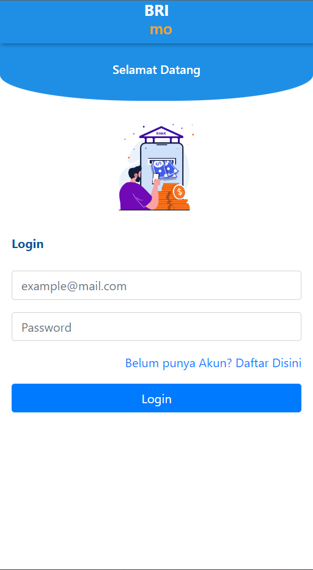
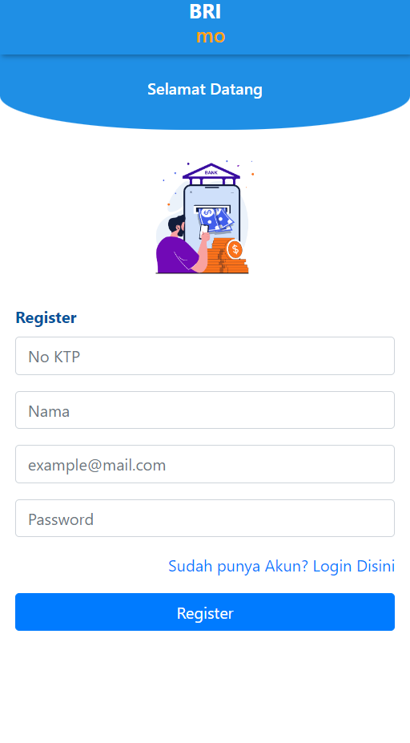
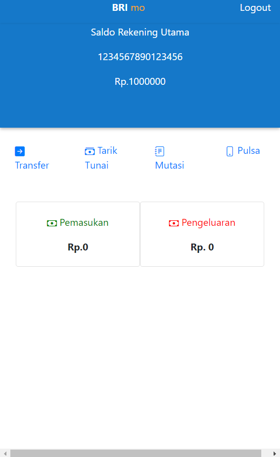
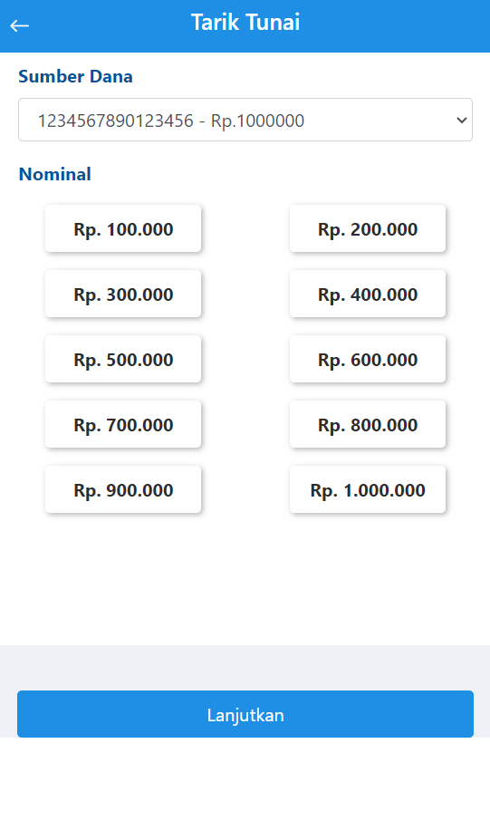

### Buatlah program yang meliputi kriteria seperti di bawah ini

-   Menerapkan penggunaan SOLID beserta penjelasan bagian-bagian implementasi SOLID dalam program tersebut
-   Ada user interface
-   Ada penggunaan database

Note

-   UAS perkelompok
-   yang di upload file program yang sudah jadi
-   dokumentasi penjelasan penerapan SOLID
-   bahasa pemrogaman bebas yang penting mendukung OOP

### Implementasi SOLID

```php
<? php

use App\Http\Controllers\HomeController;
use App\Http\Controllers\LoginController;
use App\Http\Controllers\RegisterController;
use App\Http\Controllers\MutationController;
use App\Http\Controllers\PulsaController;
use App\Http\Controllers\TransferController;
use App\Http\Controllers\WithdrawController;
use Illuminate\Support\Facades\Route;

// Web Routes

Route::group(['prefix' => 'login'], function () {
    Route::get('/', [LoginController::class, 'index'])->name('login.index');
    Route::post('/', [LoginController::class, 'attempt'])->name('login.attempt');
})->middleware('guest');

/*
   Komentar:
   - Grup route dengan prefix 'login'
   - Menggunakan GET request untuk mengakses halaman login, memanggil method 'index' pada LoginController
   - Menggunakan POST request untuk melakukan login, memanggil method 'attempt' pada LoginController
   - Nama alias route: 'login.index' dan 'login.attempt'
   - Middleware 'guest' digunakan untuk memastikan hanya pengguna yang belum login yang dapat mengakses route ini
*/

Route::group(['prefix' => 'register'], function () {
    Route::get('/', [RegisterController::class, 'index'])->name('register.index');
    Route::post('/', [RegisterController::class, 'store'])->name('register.store');
})->middleware('guest');

/*
   Komentar:
   - Grup route dengan prefix 'register'
   - Menggunakan GET request untuk mengakses halaman register, memanggil method 'index' pada RegisterController
   - Menggunakan POST request untuk melakukan registrasi, memanggil method 'store' pada RegisterController
   - Nama alias route: 'register.index' dan 'register.store'
   - Middleware 'guest' digunakan untuk memastikan hanya pengguna yang belum login yang dapat mengakses route ini
*/

Route::group(['middleware' => 'auth'], function () {

    Route::get('/', [HomeController::class, 'index'])->name('home');

    /*
       Komentar:
       - Menggunakan GET request untuk mengakses halaman utama (home), memanggil method 'index' pada HomeController
       - Nama alias route: 'home'
       - Middleware 'auth' digunakan untuk memastikan hanya pengguna yang sudah login yang dapat mengakses route ini
    */

    Route::group(['prefix' => 'transfer'], function () {
        Route::get('/', [TransferController::class, 'index'])->name('transfer.index');
        Route::get('/proses', [TransferController::class, 'create'])->name('transfer.create');
        Route::post('/', [TransferController::class, 'store'])->name('transfer.store');
    });

    /*
       Komentar:
       - Grup route dengan prefix 'transfer'
       - Menggunakan GET request untuk mengakses halaman transfer, memanggil method 'index' pada TransferController
       - Menggunakan GET request untuk mengakses halaman proses transfer, memanggil method 'create' pada TransferController
       - Menggunakan POST request untuk melakukan transfer, memanggil method 'store' pada TransferController
       - Nama alias route: 'transfer.index', 'transfer.create', dan 'transfer.store'
    */

    Route::group(['prefix' => 'tarik-tunai'], function () {
        Route::get('/', [WithdrawController::class, 'create'])->name('withdraw.create');
        Route::post('/', [WithdrawController::class, 'store'])->name('withdraw.store');
        Route::get('/proses', [WithdrawController::class, 'process'])->name('withdraw.process');
        Route::post('/proses', [WithdrawController::class, 'done'])->name('withdraw.done');
    });

    /*
       Komentar:
       - Grup route dengan prefix 'tarik-tunai'
       - Menggunakan GET request untuk mengakses halaman tarik tunai, memanggil method 'create' pada WithdrawController
       - Menggunakan POST request untuk melakukan tarik tunai, memanggil method 'store' pada WithdrawController
       - Menggunakan GET request untuk mengakses halaman proses tarik tunai, memanggil method 'process' pada WithdrawController
       - Menggunakan POST request untuk menyelesaikan proses tarik tunai, memanggil method 'done' pada WithdrawController
       - Nama alias route: 'withdraw.create', 'withdraw.store', 'withdraw.process', dan 'withdraw.done'
    */

    Route::group(['prefix' => 'mutasi'], function () {
        Route::get('/', [MutationController::class, 'index'])->name('mutation.index');
    });

    /*
       Komentar:
       - Grup route dengan prefix 'mutasi'
       - Menggunakan GET request untuk mengakses halaman mutasi, memanggil method 'index' pada MutationController
       - Nama alias route: 'mutation.index'
    */

    Route::group(['prefix' => 'pulsa'], function () {
        Route::get('/', [PulsaController::class, 'create'])->name('pulsa.create');
        Route::post('/', [PulsaController::class, 'store'])->name('pulsa.store');
    });

    /*
       Komentar:
       - Grup route dengan prefix 'pulsa'
       - Menggunakan GET request untuk mengakses halaman pulsa, memanggil method 'create' pada PulsaController
       - Menggunakan POST request untuk melakukan pembelian pulsa, memanggil method 'store' pada PulsaController
       - Nama alias route: 'pulsa.create' dan 'pulsa.store'
    */

    Route::get('/logout', [LoginController::class, 'logout'])->name('logout');

    /*
       Komentar:
       - Menggunakan GET request untuk melakukan logout, memanggil method 'logout' pada LoginController
       - Nama alias route: 'logout'
    */
});
```

### Penjelasan Solid

1. Single Responsibility Principle (SRP):

-   <details>
      <summary>Penjelasan</summary>
      Setiap controller (misalnya HomeController, LoginController, RegisterController, dll.) bertanggung jawab untuk menangani permintaan terkait dengan fungsi khusus yang diwakilinya. Misalnya, LoginController bertanggung jawab untuk mengelola proses login, RegisterController bertanggung jawab untuk mengelola proses registrasi, dan seterusnya. Setiap controller memiliki tanggung jawab tunggal yang terpisah dari yang lain.
    </details>

2. Open/Closed Principle (OCP):

-   <details>
      <summary>Penjelasan</summary>
        Dalam kode tersebut, tidak ada perubahan langsung pada rute yang ada saat menambahkan atau memperluas fitur baru. Sebagai gantinya, rute baru ditambahkan dalam grup yang sesuai. Misalnya, ketika ingin menambahkan fitur "mutasi" atau "pulsa", saya menambahkan grup rute baru dan menghubungkannya dengan controller yang relevan. Ini mengikuti prinsip OCP, di mana kode dapat diperluas dengan menambahkan fungsionalitas baru tanpa memodifikasi kode yang sudah ada.
    </details>

3. Liskov Substitution Principle (LSP):

-   <details>
      <summary>Penjelasan</summary>
        Dalam kode tersebut, saya menggunakan kelas-kelas controller yang diturunkan dari Controller di dalam Laravel. Kode ini mematuhi LSP, yang berarti objek dari kelas turunan dapat digunakan sebagai pengganti objek dari kelas induk tanpa mempengaruhi kebenaran atau konsistensi sistem.
    </details>

4. Interface Segregation Principle (ISP):

-   <details>
      <summary>Penjelasan</summary>
        Dalam kode tersebut, tidak ada penggunaan langsung terhadap prinsip ISP, karena tidak ada definisi langsung tentang antarmuka. Namun, dalam konteks framework Laravel, konsep ISP diterapkan secara internal dengan memanfaatkan antarmuka dan kontrak untuk komunikasi antara komponen-komponen sistem. Hal ini memungkinkan adanya pemisahan antarmuka yang spesifik dan terpisah untuk setiap komponen.
    </details>

5. Dependency Inversion Principle (DIP):

-   <details>
      <summary>Penjelasan</summary>
        Dalam kode tersebut, dependensi controller terbalik melalui penggunaan dependency injection melalui konstruktor controller. Misalnya, dalam route '/transfer', controller TransferController dihubungkan menggunakan sintaks [TransferController::class, 'index']. Dengan menggunakan dependency injection, dependensi controller disediakan dari luar (dalam hal ini, oleh framework Laravel) melalui konstruktor controller, mengikuti prinsip DIP.
     </details>

### User Interface






### Konfigurasi Database

Database yang digunakan pada aplikasi ini adalah berbasis SQL, tepatnya mysql, karena struktur data dari aplikasi bri mobile ini selalu tetap dan tidak sampai membutuhkan nosql.
Konektivitas ke database di laravel sudah diatur oleh frameworknya sendiri, jadi hanya perlu mengisi data pada file .env.

```sql
DB_CONNECTION=mysql
DB_HOST=127.0.0.1
DB_PORT=3306
DB_DATABASE=brimo
DB_USERNAME=root
DB_PASSWORD=toor
```

**Note**: Pastikan untuk mengganti password sesuai dengan password yang digunakan pada mysql client.

Data yang perlu diisi hanyalah seperti diatas, jenis database nya apa, lalu host dan port nya, nama database serta username dan password dari databasenya.
Karena untuk mysql clinet nya menggunakan xampp, sehingga perlu menyalakan MySQL di xampp nya terlebih dahulu.

Untuk mengecek apakah sudah terkoneksi atau belum sebenanrya hanya perlu menjalankan aplikasi laravelnya menggukana perintah : php artisan serve. Jika sudah terhubung maka tidak akan ada pesan error yang berkaitan dengan databasenya.

### Untuk Menjalankan program

Jalankan XAMPP atau sejenisnya. Jika menggunakan XAMPP, pastikan Apache dan MySQL sudah berjalan.

```bash
php artisan migrate

kemudian

php artisan migrate:refresh --seed
```

Jika sudah, jalankan perintah berikut untuk menjalankan server:

```bash
php artisan serve
```

### Demo User

Anda dapat menggunakan akun berikut atau membuat akun baru untuk mencoba aplikasi ini:

-   Email: `rifky@gmail.com`
-   Password: `password`
